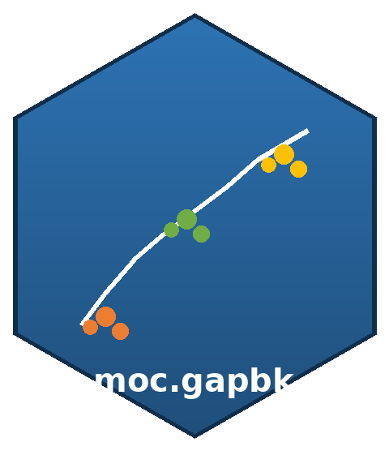

<!-- README.md is generated from README.Rmd. Please edit that file. -->

# moc.gapbk <a href="https://github.com/jorgeklz/package-moc.gapbk"></a>

<!-- badges: start -->

[](https://CRAN.R-project.org/package=moc.gapbk)
[](https://github.com/jorgeklz/package-moc.gapbk/actions/workflows/R-CMD-check.yaml)
[](https://github.com/jorgeklz/package-moc.gapbk/actions/workflows/pkgdown.yaml)
[](https://app.codecov.io/gh/jorgeklz/package-moc.gapbk)
[](https://lifecycle.r-lib.org/articles/stages.html#stable)
[](https://www.gnu.org/licenses/old-licenses/gpl-2.0.en.html)
<!-- badges: end -->

**Multi-Objective Clustering Guided by a-Priori Biological Knowledge.**

`moc.gapbk` implements the MOC-GaPBK algorithm proposed by Parraga-Alava
and others (2018). The algorithm couples **NSGA-II** with
**Path-Relinking (PR)** and **Pareto Local Search (PLS)** to produce a
set of non-dominated clustering solutions over two distance matrices:
one usually derived from the data, and a second one that encodes
a-priori biological (or domain) knowledge.

## Installation

You can install the released version of `moc.gapbk` from
[CRAN](https://CRAN.R-project.org/package=moc.gapbk) with:

``` r
install.packages("moc.gapbk")
```

Or the development version from [GitHub](https://github.com/) with:

``` r
# install.packages("pak")
pak::pak("jorgeklz/package-moc.gapbk")
```

## Basic example

A minimal end-to-end run on synthetic data:

``` r
library(moc.gapbk)

set.seed(2026)

# Toy data: 50 objects (e.g. genes) described by 20 features.
x <- matrix(stats::runif(50 * 20, min = -5, max = 10),
            nrow = 50, ncol = 20)

# Two distance matrices over the same set of objects.
d1 <- as.matrix(stats::dist(x, method = "euclidean"))
d2 <- as.matrix(stats::dist(x, method = "manhattan"))

res <- moc.gapbk(dmatrix1   = d1,
                 dmatrix2   = d2,
                 num_k      = 3,
                 generation = 5,
                 pop_size   = 6)
```

The result is a list with three components: `population`,
`matrix.solutions` and `clustering`.

``` r
names(res)
#> [1] "population"       "matrix.solutions" "clustering"
```

The first solution on the Pareto front, as a named integer vector ready
to feed into a validation index or a plot:

``` r
head(res$clustering[[1]])
#> 1 2 3 4 5 6 
#> 3 3 2 1 2 1
table(res$clustering[[1]])
#> 
#>  1  2  3 
#>  7 15 28
```

See `vignette("moc-gapbk-intro")` for a longer walkthrough, including
how to enable intensification and diversification stages with
`local_search = TRUE`.

## Algorithm overview

| Stage | Component           | Role                                     |
|-------|---------------------|------------------------------------------|
| 1     | NSGA-II             | Multi-objective evolutionary engine      |
| 2     | Path-Relinking      | Intensification between Pareto solutions |
| 3     | Pareto Local Search | Diversification across the front         |

Two versions of the **Xie-Beni** validity index are used as objective
functions, one per distance matrix. Typically `dmatrix1` is derived from
the data itself and `dmatrix2` encodes prior knowledge (for example, GO
semantic similarity in gene-clustering applications).

## Citation

If you use this package, please cite:

> Parraga-Alava, J., Dorn, M., Inostroza-Ponta, M. (2018). *A
> multi-objective gene clustering algorithm guided by apriori biological
> knowledge with intensification and diversification strategies*.
> BioData Mining 11(1), 1-16.
> <https://doi.org/10.1186/s13040-018-0178-4>

You can also run `citation("moc.gapbk")` inside R.

## Code of conduct

Please note that the `moc.gapbk` project is released with a [Contributor
Code of
Conduct](https://github.com/jorgeklz/package-moc.gapbk/blob/main/CODE_OF_CONDUCT.md).
By contributing to this project, you agree to abide by its terms.

## License

GPL-2.
